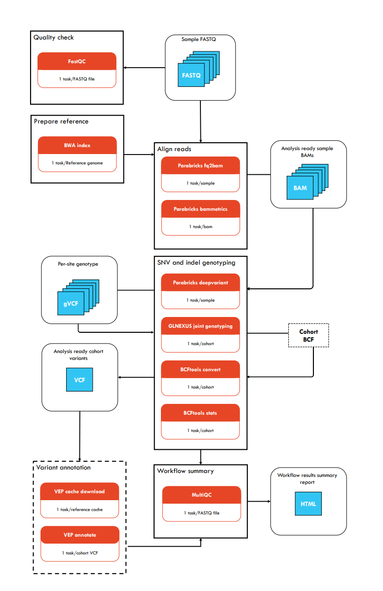

# Core workflow: Parabricks Germline Genomics 

## Description 

Parabricks-Genomics-nf is a GPU-enabled pipeline for alignment and germline short variant calling for short read sequencing data. The pipeline utilises [NVIDIA's Clara Parabricks](https://docs.nvidia.com/clara/parabricks/4.2.0/index.html) toolkit to dramatically speed up the execution of best practice bioinformatics tools. Currently, this pipeline is **configured specifically for [NCI's Gadi HPC](https://nci.org.au/our-systems/hpc-systems)**. 

NVIDIA's Clara Parabricks can deliver a significant speed improvement over traditional CPU-based methods, and is designed to be used only with NVIDIA GPUs. This pipeline is suitable for population screening projects as it executes Parabrick's implementations of BWA mem for short read alignment and Google's DeepVariant for short variant calling. Additionally, it uses standard CPU implementations of data quality evaluation tools [FastQC](https://www.bioinformatics.babraham.ac.uk/projects/fastqc/) and [MultiQC](https://multiqc.info/) and [DNAnexus' GLnexus](https://academic.oup.com/bioinformatics/article/36/24/5582/6064144) for scalable gVCF merging and joint variant calling. Optionally, [Variant Effect Predictor (VEP)](https://genomebiology.biomedcentral.com/articles/10.1186/s13059-016-0974-4) can be run for variant annotation. 

DeepVariant and GLnexus have been shown to outperform GATK's HaplotypeCaller and GenomicsDB in terms of accuracy and scalability ([Yun et al. 2020](https://academic.oup.com/bioinformatics/article/36/24/5582/6064144), [Barbitoff et al. 2022](https://bmcgenomics.biomedcentral.com/articles/10.1186/s12864-022-08365-3), [Lin et al. 2022](https://www.nature.com/articles/s41598-022-05833-4), [Abdelwahab et al. 2023](https://bmcbioinformatics.biomedcentral.com/articles/10.1186/s12859-023-05596-3)). [DeepVariant](https://github.com/google/deepvariant) employs a deep learning technique to call short variants (SNVs and indels) which leads to higher accuracy and sensitivity compared with traditional variant callers. However, it has only been trained on human data. 

Users intending to use this pipeline for non-human species should consider the findings of this [post](https://google.github.io/deepvariant/posts/2018-12-05-improved-non-human-variant-calling-using-species-specific-deepvariant-models/) regarding Mendelian violation rate to determine if this pipeline meets their needs. GLnexus is a scalable joint genotyper that can merge gVCFs from multiple samples and call variants in a single step. Please submit a [feature request issue](https://github.com/Sydney-Informatics-Hub/Parabricks-Genomics-nf/issues/new?assignees=&labels=enhancement&projects=&template=feature_request.yml) on this repository to request support for non-human species.  



## User guide (NCI Gadi HPC only)

NCI has installed a slightly customised version of Nextflow on Gadi that allows you to simplify the use of the [`clusterOptions`](https://www.nextflow.io/docs/latest/process.html#process-clusteroptions) directive, specific to the system. See NCI's [Nextflow guide](https://opus.nci.org.au/display/DAE/Nextflow) for details and the [`gadi.config`]() for how this has been implemented in this pipeline. 

### 0. Set up 

Download the code contained in this repository with:

```bash
git clone https://github.com/Sydney-Informatics-Hub/Parabricks-Genomics-nf.git
```

This will create a directory with the following structure:

```bash
Parabricks-Genomics-nf/
├── assets/
├── bin/
├── config/
├── LICENSE
├── main.nf
├── modules/
├── nextflow.config
└── README.md
```

The important features are:

* **main.nf** contains the main nextflow script that calls all the processes in the workflow.
* **nextflow.config** contains default parameters to use in the pipeline.
* **config** contains infrastructure-specific configuration files. 
* **modules** contains individual process files for each step in the workflow.
* **bin** contains scripts executed by the pipeline 

Keep in mind that this pipeline assumes all your data will be contained within one project code's `/scratch` and `/g/data` directories, as specified by the parameter `--gadi_account`. If you are working across multiple project codes, you will need to manually edit this line in the `gadi.config` to reflect this:

```bash
storage = "scratch/${params.gadi_account}+gdata/${params.gadi_account}"
``` 

As with all Gadi jobs, Nextflow processes run by this pipeline will only be able to access project directories specified by the `# PBS -lstorage` variable. 

### 1. Prepare inputs 

To run this pipeline you will need the following sample inputs:

* Paired-end fastq files
* Input sample sheet

This pipeline processes paired-end fastq files and is capable of processing multiple samples in parallel. You will need to create a sample sheet with all metadata for the cohort you are processing, before running the pipeline. This file must be **comma-separated** and contain a header and one row per sample. Columns should correspond to `sample`,`fq1`,`fq2`,`platform`,`library`,`center`, where: 

* header must be written as sample,fq1,fq2,platform,library,center 
* `sample` is the unique identifier for the sample
* `fq1` is the path to the first fastq file
* `fq2` is the path to the second fastq file
* `platform` is the sequencing platform used (e.g. illumina)
* `library` is the library identifier (e.g. 1)
* `center` is the sequencing center (e.g. nfcoreraredisease)

For samples with > 1 fastq pairs, create a new line for each fastq pair. The pipeline is designed to handle multiple fastq pairs per sample if required. 

Here is an example of what your input file should look like. Note `sample1` has multiple fastq pairs across two lanes, while `sample2` and `sample3` have one fastq pair each:

```csv
sample,fq1,fq2,platform,library,center
sample1,/scratch/aa00/sample1_L001_1_1k.fastq.gz,/scratch/aa00/sample1_L001_2_1k.fastq.gz,illumina,1,Ramaciotti
sample1,/scratch/aa00/sample1_L002_1_1k.fastq.gz,/scratch/aa00/sample1__L002_2_1k.fastq.gz,illumina,1,Ramaciotti
sample2,/scratch/aa00/sample2_1_1k.fastq.gz,/scratch/aa00/sample2_2_1k.fastq.gz,illumina,1,Ramaciotti
sample3,/scratch/aa00/sample3_1_1k.fastq.gz,/scratch/aa00/sample3_2_1k.fastq.gz,illumina,1,Ramaciotti
```

When you run the pipeline, you will use the mandatory `--input` parameter to specify the location and name of the input file:

```bash
--input /path/to/samples.tsv
```

### 2. Prepare reference materials 

To run this pipeline you will need the following reference files:

* A reference genome in FASTA format 
* [Optional] A VEP cache for variant annotation with VEP

#### 2.1 Reference fasta 

You will need to download a copy of the reference genome you would like to use. If you are working with a species that has a public reference genome, you can download FASTA files from the [Ensembl](https://asia.ensembl.org/info/data/ftp/index.html), [UCSC](https://genome.ucsc.edu/goldenPath/help/ftp.html), or [NCBI](https://www.ncbi.nlm.nih.gov/genome/doc/ftpfaq/) ftp sites. 

If your reference fasta is not already indexed, the `bwa_index` process in this pipeline will index the provided fasta file using [`bwa index`](https://bio-bwa.sourceforge.net/bwa.shtml). 

When you run the pipeline, you will use the mandatory `--ref` parameter to specify the location and name of the reference.fasta file:

```
--ref /path/to/reference.fasta
```

#### 2.2 Variant effect predictor cache 

An optional feature of this workflow is to annotate output variants with Ensembl's [Variant Effect Predictor](https://asia.ensembl.org/info/docs/tools/vep/index.html). You can opt to download the required cache using the `--download_vep_cache` flag, additionally specifying the species and assembly you require: 

```bash
--download_vep_cache
--vep_species homo_sapiens
--vep_assembly GRCh38
```

For available species caches, please see the [VEP cache download site](https://ftp.ensembl.org/pub/release-111/variation/vep/) to determine which species and assembly you need to specify. Please keep in mind that VEP requires you to specify species and assembly as they are named in these files.  

### 3. Run the pipeline 

The most basic run command for this pipeline is:

```bash
nextflow run main.nf --input sample.tsv --ref /path/to/ref -gadi_account <account-code> -profile gadi
```

This will run the following processes: 

* Check validity of provided inputs 
* [FastQC](https://www.bioinformatics.babraham.ac.uk/projects/fastqc/) for summary of raw reads
* [BWA index](https://bio-bwa.sourceforge.net/bwa.shtml) if bwa indexes for your provided reference fasta are not detected
* [Parabricks' fq2bam](https://docs.nvidia.com/clara/parabricks/4.2.0/documentation/tooldocs/man_fq2bam.html#man-fq2bam) for performing read alignment and generating bam files for individuals
* [Parabricks' deepvariant](https://docs.nvidia.com/clara/parabricks/4.2.0/documentation/tooldocs/man_deepvariant.html#man-deepvariant) for performing SNV/indel genotyping for individuals 
* [Parabricks' bammetrics](https://docs.nvidia.com/clara/parabricks/4.2.0/documentation/tooldocs/man_bammetrics.html#man-bammetrics) for generating alignment metrics 
* [Glnexus](https://github.com/dnanexus-rnd/GLnexus) for joint genotyping of all individuals and creation of a cohort-level BCF file 
* [BCFtools convert](https://samtools.github.io/bcftools/bcftools.html) to convert the cohort BCF to a VCF
* [BCFtools stats](https://samtools.github.io/bcftools/bcftools.html) for summary statistics of the cohort VCF
* [MultiQC](https://multiqc.info/) for generating a summary html report of all processes

Additionally, you can run variant annotation using variant effect predictor by adding some additional flags `--download_vep_cache`, `--vep_species`, and `--vep_assembly` as specified in [section 2.2](#22-variant-effect-predictor-cache) above: 

```bash
nextflow run main.nf --input <samplesheet.csv> --ref <ref.fasta> --download_vep_cache --vep_species <species> --vep_assembly <genome assembly> -gadi_account <account-code> -profile gadi 
```

In addition to all steps above, this will run: 
* [VEP download](https://asia.ensembl.org/info/docs/tools/vep/script/vep_cache.html) to collect the cache required for variant annotation
* [VEP annotate](https://asia.ensembl.org/info/docs/tools/vep/script/vep_options.html) to annotate the cohort VCF with downloade cache data

You will need to identify which species and assembly you require for the VEP cache download. See [section 2.2](#22-variant-effect-predictor-cache) above for instructions on how to do this. For example, running on a human dataset, aligned to the GRCh38 reference genome, you would use the following command: 

```bash
nextflow run main.nf --input samplesheet.csv --ref path/to/GRCh38.fasta --download_vep_cache --vep_species homo_sapiens --vep_assembly GRCh38 -gadi_account <account-code> -profile gadi 
```

If you are working across multiple project spaces on Gadi and need access to additional storage beyond `-gadi_account <account-code>`, you can use the `-storage_account <account-code>` to specify access to storage in addition to `/g/data` and `/scratch` for connected to the `-gadi_account` project.

You can see all flags supported by this pipeline by running:

```bash
nextflow run main.nf --help
```

### 4. Review results 

By default, all outputs of this pipeline will be saved to a directory called `results`. You can customise the name of this directory using the `--outdir` flag. The structure of the saved outputs are: 

```bash
results/
├── annotations/
├── bams/
├── fastqc/
├── multiqc/
├── variants/
└── VEP_cache/
```

* `fastqc/` contains fastq-level summary reports organised into sample-level subdirectories
* `bams/` contains alignment files and qc reports organised into sample-level subdirectories 
* `variants/` contains sample-level g.vcf files organised into sample-level subdirectories, a cohort-level bcf and vcf file, and a cohort-level variant summary file 
* `annotations/` contains an annotated cohort-level VEP file and cohort-level summary report
* `multiqc/` contains a summary report of all processes run by the pipeline 
* `VEP_cache/` contains the downloaded VEP cache files used for variant annotation

As first port of call, we recommend looking through the MultiQC report to confirm there are no unexpected results or quality issues with any samples. 

### Running on other infrastructures

To run this pipeline on infrastructures other than NCI Gadi, you will need to create a custom configuration file and include this within the `profiles {}` section in the `nextflow.config`.  

## Workflow summaries
### Metadata

|Metadata field     | Parabricks-Genomics-nf / v1.0.0   |
|-------------------|:--------------------------------- |
|Version            | 1.0.0                             |
|Maturity           | First release                     |
|Creators           | Georgie Samaha                    |
|Source             | NA                                |
|License            | GNU General Public License v3.0   |
|Workflow manager   | Nextflow                          |
|Container          | See component tools               |
|Install method     | NA                                |
|GitHub             | https://github.com/Sydney-Informatics-Hub/Parabricks-Genomics-nf |
|bio.tools          | NA                                |
|BioContainers      | NA                                |
|bioconda           | NA                                |

### Component tools

To run this pipeline you must have Nextflow and Singularity installed. All other tools are run as containers using Singularity.

|Tool         | Version  |
|-------------|:---------|
|Nextflow     |>=20.07.1 |
|Singularity  |          |
|Parabricks   |4.2.0     |
|BCFtools     |1.17      |
|BWA          |0.7.17    |
|FastQC       |0.12.1    |
|Glnexus      |0.2.7     |
|MultiQC      |1.21      |
|VEP          |110.1     |


## Additional notes

### Error troubleshooting 

Parabricks error reporting can be a bit vague sometimes. If you find you are receiving an error: 
```
cudaSafeCall() failed at ParaBricks/src/samGenerator.cu/819: an illegal memory access was encountered
``` 

Check your fasta is formatted correctly and that your input files are all correctly captured by the `storage` variable in the `nextflow.config`. 

### VEP cache download 

This download speed for this process can be a bit inconsistent and is dependent on Ensembl's ftp server. Sometimes it takes a couple of minutes, other times it can take hours. If you are having trouble downloading the cache, delete the specific work directory corresponding to the download process and rerun the pipeline using the `-resume` flag. 

## Help / FAQ / Troubleshooting

Submit an issue to get in contact with us regarding:

* [Unexpected performance/bugs in the code](https://github.com/Sydney-Informatics-Hub/Parabricks-Genomics-nf/issues/new?assignees=&labels=bug&projects=&template=bug_report.yml)
* [Requesting a new feature](https://github.com/Sydney-Informatics-Hub/Parabricks-Genomics-nf/issues/new?assignees=&labels=enhancement&projects=&template=feature_request.yml)
* [General support](https://github.com/Sydney-Informatics-Hub/Parabricks-Genomics-nf/issues/new)

## Acknowledgements/citations/credits

Acknowledgements (and co-authorship, where appropriate) are an important way for us to demonstrate the value we bring to your research. Your research outcomes are vital for ongoing funding of the Sydney Informatics Hub and national compute facilities.

### **Authors**
* Georgina Samaha (Sydney Informatics Hub, University of Sydney)
* Cali Willet (Sydney Informatics Hub, University of Sydney)

### **Suggested acknowledgement**  
The authors acknowledge the support provided by the Sydney Informatics Hub, a Core Research Facility of the University of Sydney. This research/project was undertaken with the assistance of resources and services from the National Computational Infrastructure (NCI), which is supported by the Australian Government, and the Australian BioCommons which is enabled by NCRIS via Bioplatforms Australia funding.

### Cite us to support us! 

Samaha, G. Willet, C. (2024). Parabricks-Genomics-nf [Computer software] https://doi.org/10.48546/WORKFLOWHUB.WORKFLOW.836.1